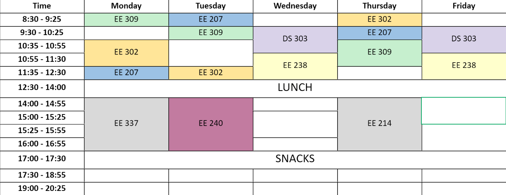
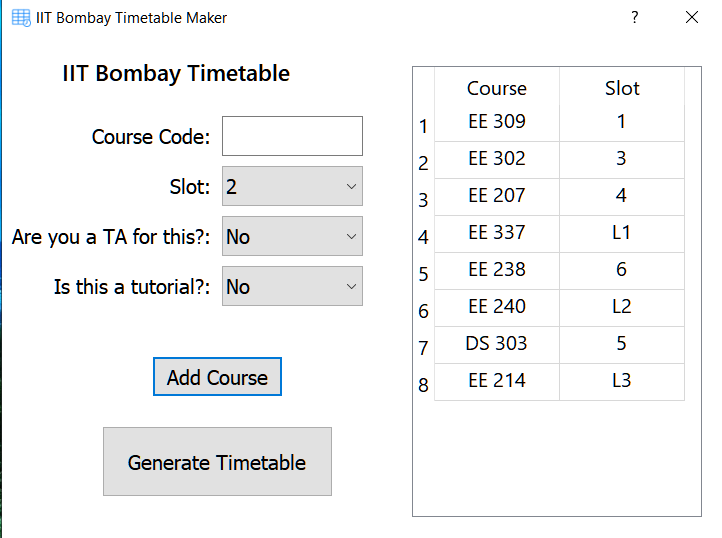

# IITB-Timetable-generator

This is a program to generate colored excel timetables from the slots you can see on internal ASC, such as: 




A GUI is provided to choose the courses. 




## Installation
1. Clone the repository :
```bash
git clone https://github.com/EeshaanJain/IITB-Timetable-generator.git
```
2. Run pip on the requirements.txt file to get the dependencies :
```python
pip -r requirements.txt
```

## How to make the timetable
1. Run the timetable.py file using
 ```python
python timetable.py
```
2. A GUI will pop-up with the following features:

   a. Course Code: Enter the course code here, for example: EE 204
   
   b. Slot: Choose the slot for the course here (can be seen from ASC). Note that this dynamically updates the slots, i.e if you suppose choose slot X1, you no longer can choose slot Lx for any of the courses due to overlap. Similarly for L1-6 and other overlaps with Lx. Hence slot clashes can be prevented.
   
   c. Are you a TA for this?: This is asking if you are TAing any course (usually 1st year courses) and you can choose a slot for the TAship, and the title will be filled as "Course Code (TA)"
   
   d. Is this a tutorial?: This is asking if the slot is a tutorial, if so fill this with "Yes" and the title will be filled as "Course Code (Tut)"
   
   e. You can see the courses and slots you're filling in a table right next to the input area.
   
   f. After every course, click 'Add Course' to add the course to the list.
   
3. Once you're done with all the courses, click on Generate Timetable. This will generate the timetable and save it as "Timetable.xlsx" in the same directory. Open this up in any xlsx viewer and either save it as pdf/png/jpeg (or whatever) or take a screenshot, and voila, you have a readable timetable :wink:
   
